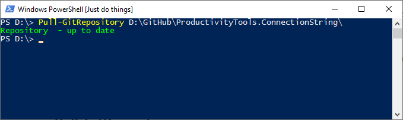
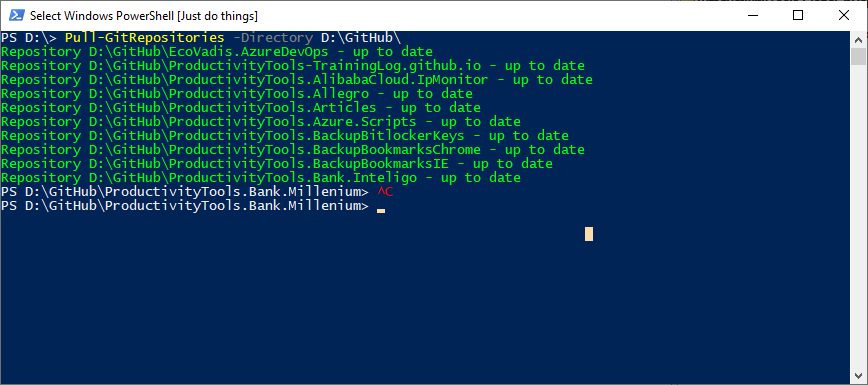
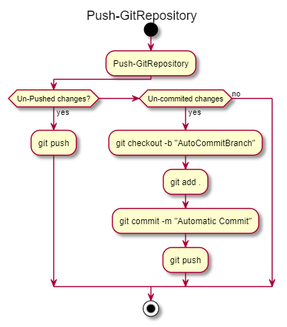
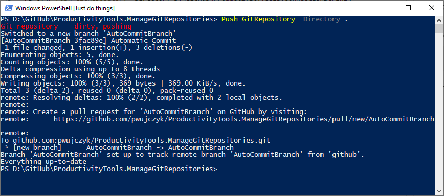
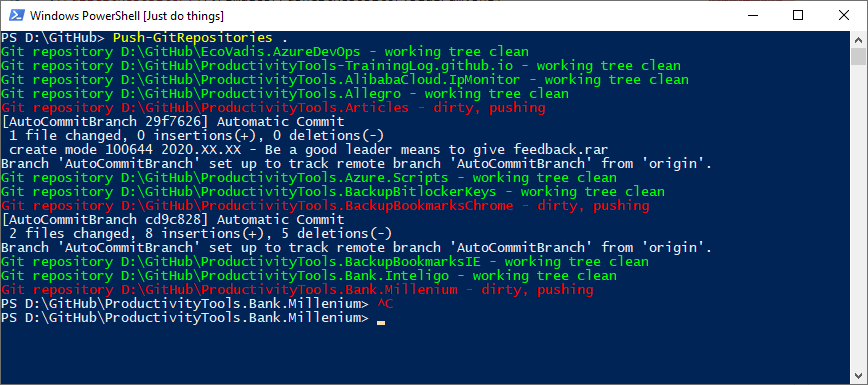
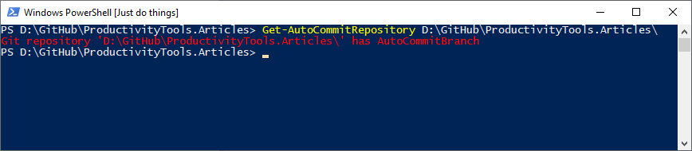
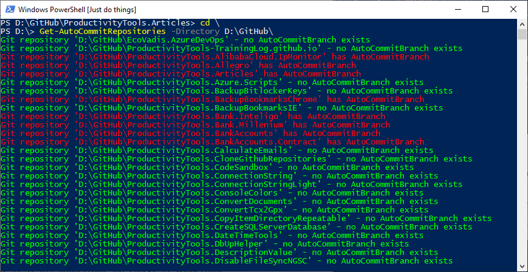
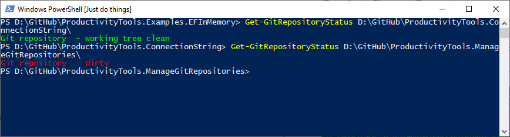
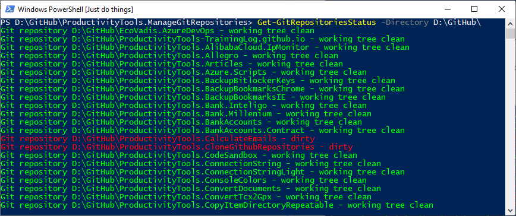

<!--Category:PowerShell--> 
 <p align="right">
    <a href="https://www.powershellgallery.com/packages/ProductivityTools.ManageGitRepositories/"></a>
    <a href="http://productivitytools.tech/manage-git-repositories/"><a> 
    <a href="https://github.com/pwujczyk/ProductivityTools.ManageGitRepositories"></a>
</p>
<p align="center">
    <a href="http://http://productivitytools.tech/">
        
    </a>
</p>

# Manage Git repositories


Module allows to manage multiple repositories at the same time. I am using it as a backup tool. 

<!--more-->

Every day I am scanning my repositories and check if any of it has some uncommited changes. If yes, changes are pushed. If changes weren't staged, new *AutoCommitBranch* branch is created and data is pushed there.

Module also allow me to update all repositories from given directory.

Check out detailed description of the commands below.

## Pull-GitRepository

Performs git pull for given directory. Following command will

- open `D:\GitHub\ProductivityTools.ConnectionString\`
- check if directory is git repository
- perform git pull 
- show message.

```powershell
Pull-GitRepository D:\GitHub\ProductivityTools.ConnectionString\
```




## Pull-GitRepositories
Iterates through list of directories under directory provided and invokes git pull for each repository.

```powershell
Pull-GitRepositories D:\GitHub\
```


## Push-GitRepository
It pushes changes to the Git repository. If current branch is ahead of remote, it will push it, if changes are not commited it will create AutoCommit branch and push all changes to it.


<!--og-image-->


```powershell
Push-GitRepository -Directory D:\GitHub\ProductivityTools.ConnectionString\
```


## Push-GitRepositories
It iterates through given directory and for each directory inside it will invoke Push-GitRepository cmdlet.

```powershell
Push-GitRepositories D:\GitHub\
```

It will open GitHub directory and foreach directory inside it will invoke Push-GitRepository



## Get-AutoCommitRepository

Checks if git repository contains AutoCommitBranch branch. 

```powershell
Get-AutoCommitRepository D:\GitHub\ProductivityTools.Meetings\
```



## Get-AutoCommitRepositories
Iterates through all git repositories inside provided directory and invokes Get-AutoCommitRepository for each.

```powershell
Get-AutoCommitRepositories -Directory D:\GitHub\
```




## Get-GitRepositoryStatus
Checks if given repository has something to be commited.

```powershell
Get-GitRepositoryStatus D:\GitHub\ProductivityTools.ConnectionString\
```




## Get-GitRepositoriesStatus
Iterates through all git repositories inside provided directory and invokes Get-GitRepositoryStatus for each.

```powershell
Get-GitRepositoriesStatus -Directory D:\GitHub\
```



